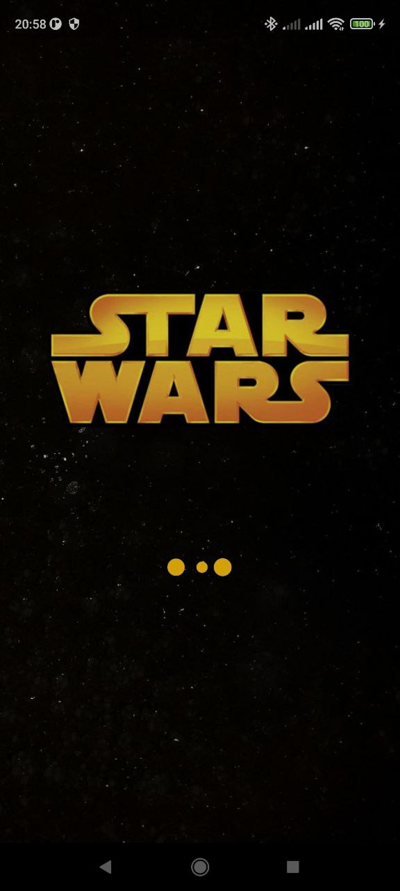
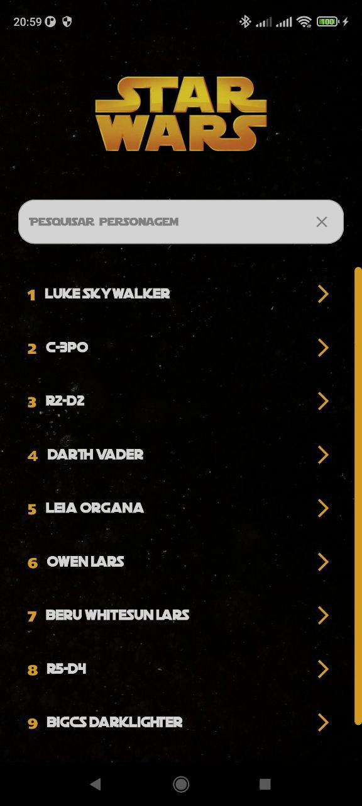
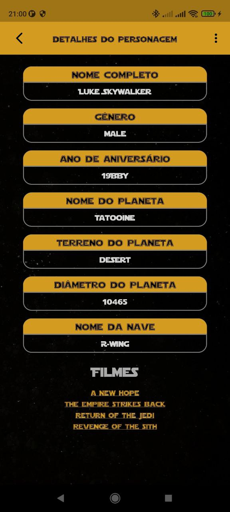
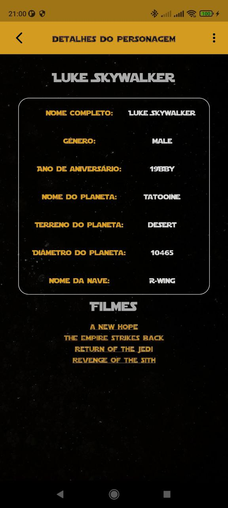
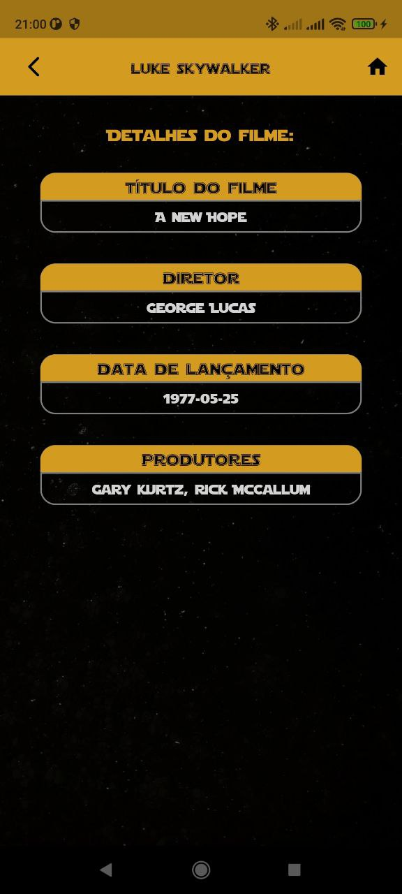

# Star Wars - App Flutter

Projeto desenvolvido para realizar consulta dos personagens do Star Wars e seus detalhes.

> O aplicativo consome dados da SWAPI, uma API aberta sobre Star Wars.

```sh
> [**https://swapi.dev/documentation#start**](https://swapi.dev/documentation#start)
```

## Screenshots

<p float="left">
  
    
    
    
    
</p>

## Packages utilizados

Foram utilizados os packages abaixo para auxiliar na construção do projeto:

- dio: ^4.0.6
- get: ^4.6.5
- flutter_dotenv: ^5.0.2
- lazy_load_scrollview: ^1.3.0
- loading_animation_widget: ^1.2.0+3
